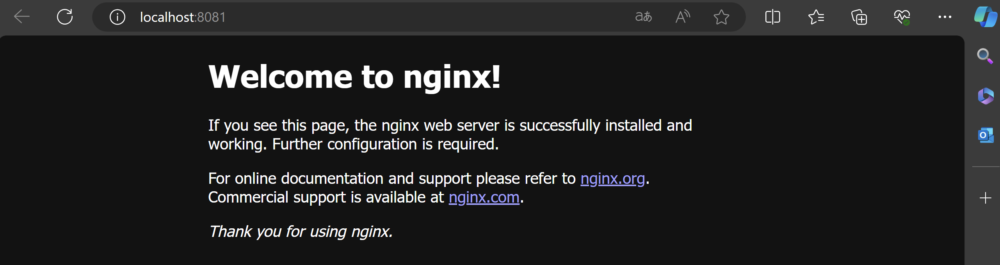
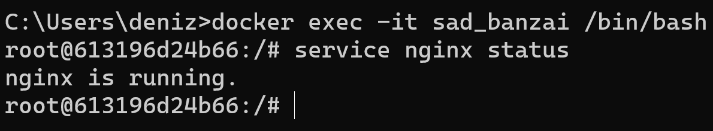
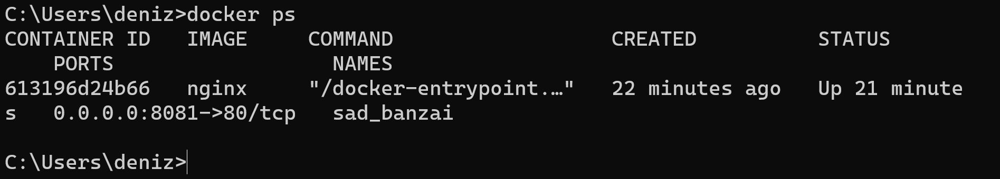
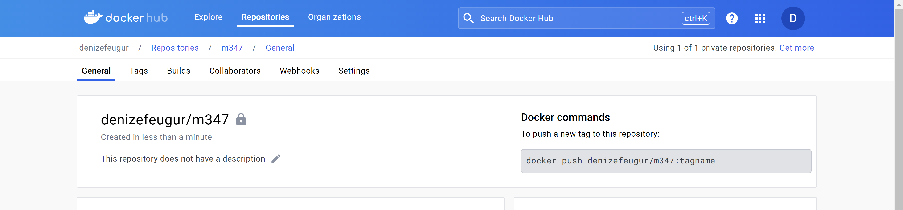
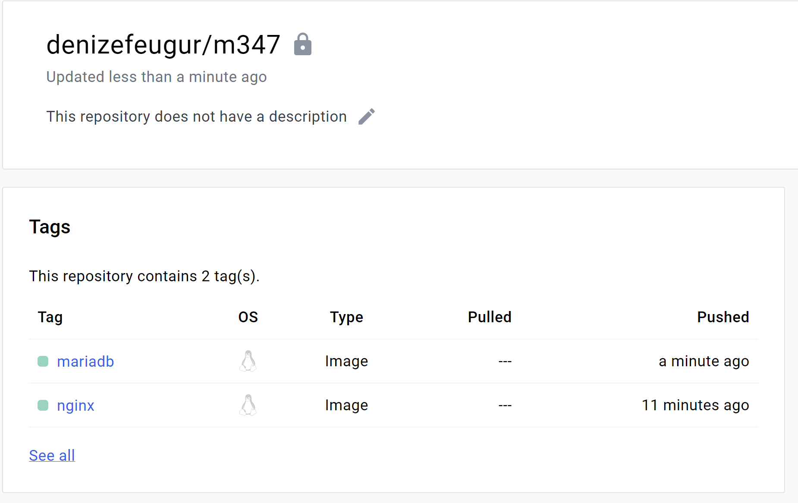

# Aufgabe B

### Aufgabe 1
überprüfung von docker version:

``` sh
wsl --status
```

### Aufgabe 2
``` sh
Docker search ngnix

Docker search ubuntu
```

### Aufgabe 3

1. `-d`: Dies steht für "detach" und wird verwendet, um den Container im Hintergrund (daemon mode) laufen zu lassen. Ohne dieses Flag würde der Container im Vordergrund ausgeführt und die Steuerung des Terminals blockieren.

2. `-p 80:80`: Dies steht für "port mapping" und wird verwendet, um Ports zwischen dem Hostsystem und dem Container zu verbinden. In diesem Fall wird Port 80 des Containers mit Port 80 des Hostsystems verbunden. Das bedeutet, dass der Container über Port 80 des Hosts erreichbar ist.
   
### Aufgabe 4


### Aufgabe 5

**docker run -d ubuntu**
1. Zuerst findet es kein Image wo ubuntu heisst.
2. Es pullt zuerst ein image namens ubuntu
3. Ich kann den container nicht laufen lassen 

**docker run -it ubuntu**
1. Docker sucht nach dem ubuntu-Image lokal auf Ihrem System. Wenn das Image nicht lokal vorhanden ist, wird es aus dem Docker-Hub heruntergeladen.

2. Ein neuer Container wird aus dem ubuntu-Image erstellt.

3. Die -it Flag steht für "Interaktiver Modus" und "TTY" (Teletyp), was bedeutet, dass Docker ein interaktives Terminal im Container öffnet, das es Ihnen ermöglicht, mit dem Container zu interagieren.

### Aufgabe 6
6.1 
6.2 ```exit```


### Aufgabe 7


### Aufgabe 8
```docker stop sad_bankai```

### Aufgabe 9
```docker container prune```

### Aufgabe 10
```docker rmi ubuntu```
```docker rmi nginx```

# Aufgabe C

Privates repo:



# Aufgabe D
``nginx:latest:`` Dies ist der Ausgangspunkt des Images, das man umbenennen möchten. Hier handelt es sich um das Image "nginx" mit dem Tag "latest". "latest" ist die Standardbezeichnung für die neueste Version eines Images.

``denizefeugur/m347:nginx:`` Dies ist der neue Name und Tag, den man dem Image zuweisen möchten. "denizefeugur/m347" ist der Name des Benutzers auf Docker Hub oder dem Registry-Server, gefolgt von einem Schrägstrich. "nginx" ist der neue Tag, den man dem Image geben möchten.

**Tag:**
Ein Tag ist sozusagen die Versionierung von einem Image.


#### ``docker push denizefeugur/m347:nginx``:
Der Befehl docker push denizefeugur/m347:nginx lädt das lokale Docker-Image mit dem Namen "denizefeugur/m347:nginx" in ein Docker-Registry hoch.

``` sh
docker tag mariadb:latest denizefeugur/m347:mariadb
docker push denizefeugur/m347:mariadb
```

Screenshot mit allen tags:

