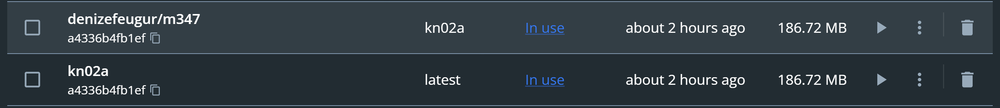
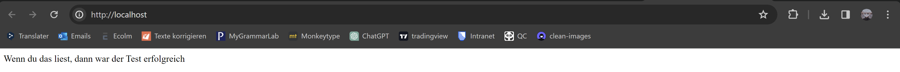

# Aufgabe A 
Docker container builden
``` sh
docker build -t kn02a .
```

Tag setzten und ins repository pushen

``` sh
docker tag kn02a:latest denizefeugur/m347:kn02a
docker push denizefeugur/m347:kn02a
```
kn02a image:


docker container laufen lassen
``` sh
docker run -d -p 80:80 kn02a
```
<br />

websseite aufrufen

