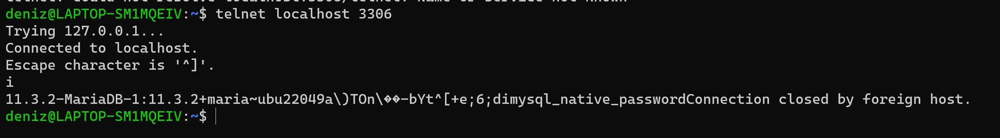
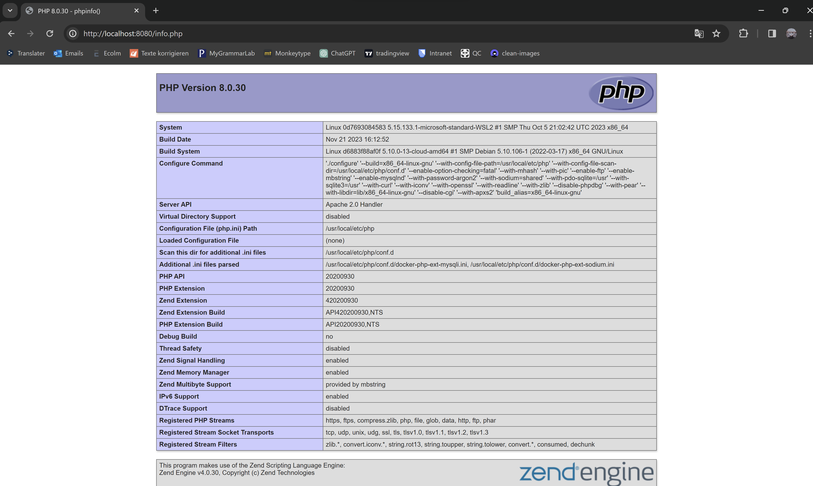
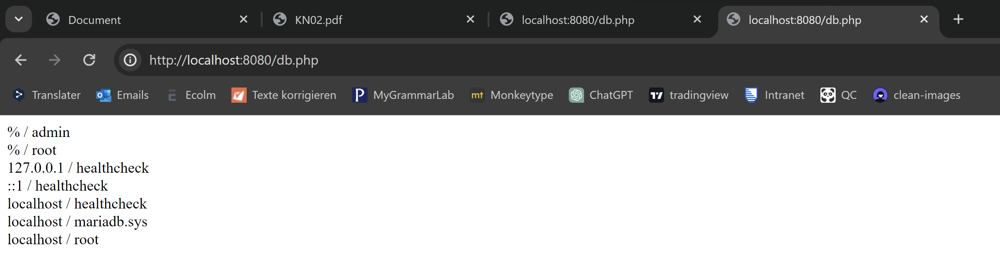

``` sh
docker network create kn02b
```

``` sh
cd db
docker build -t kn02b-db .
```

``` sh
cd web
docker build -t kn02b-web .
```

``` sh
cd web
docker run -d -p 8080:80 --network kn02b --name kn02b-web kn02b-web
```


``` sh
cd db
docker run -d -p 3306:3306 --network kn02b --name kn02b-db kn02b-db
```


Telnet



verbindung zu db und info

