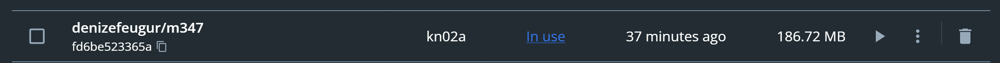
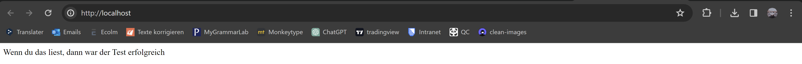

# Aufgabe A 
Docker container builden
``` sh
docker build nginx .
```

Tag setzten und ins repository pushen

``` sh
docker tag nginx:latest denizefeugur/m347:kn02a
docker push denizefeugur/m347:kn02a
```
kn02a image:


docker container laufen lassen
``` sh
docker run -d -p 80:80 fd6be523365aad6c19c68a450f048dad062c5a89c6da35d23639778505a702ba
```
<br />

websseite aufrufen


