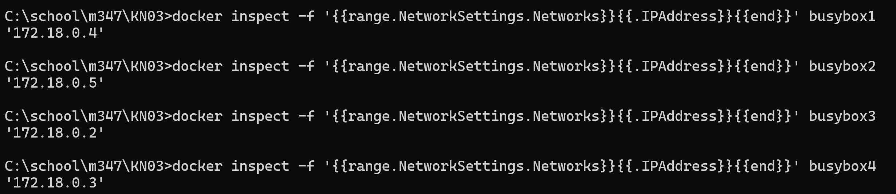
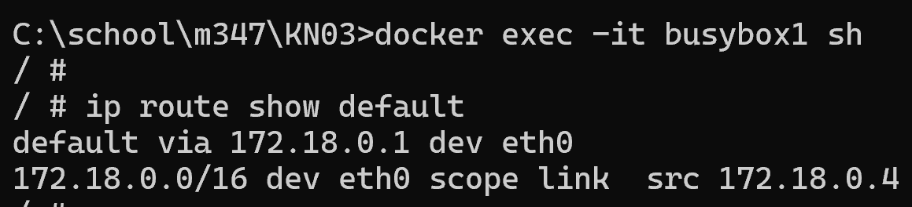
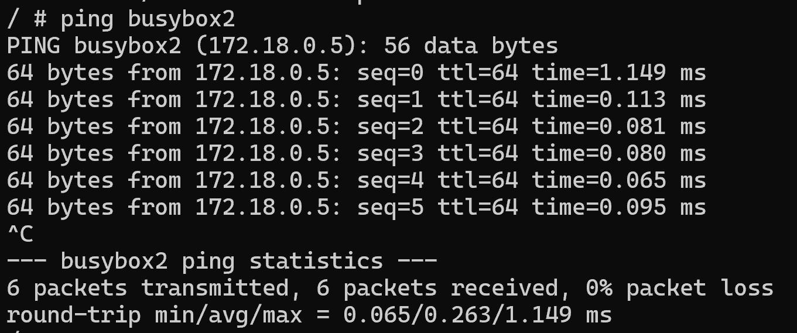
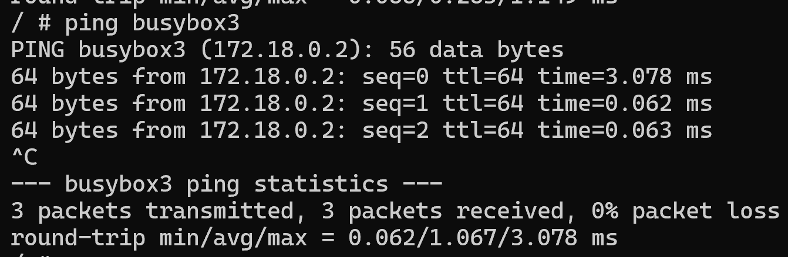
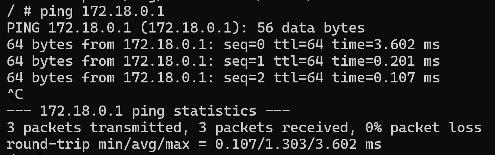
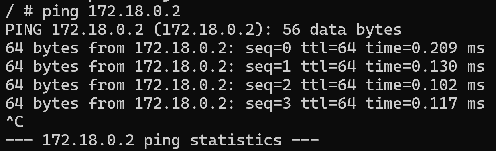
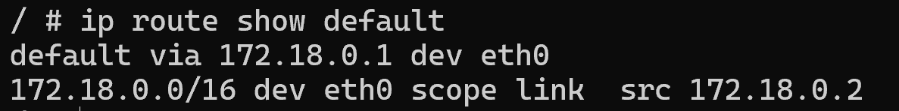
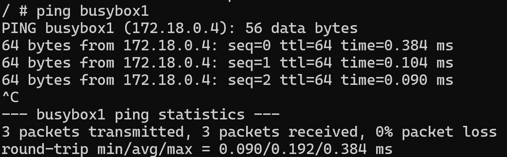
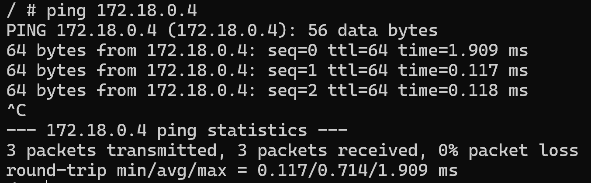
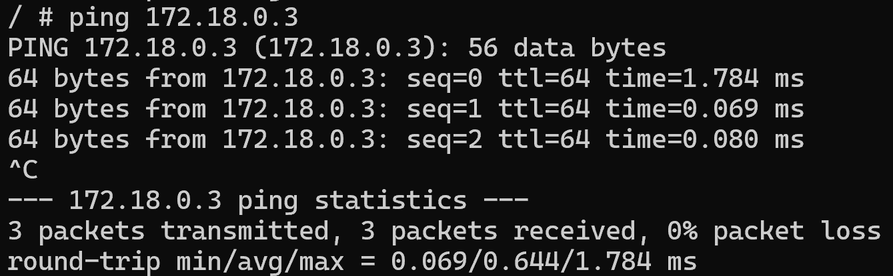

Netzwek erstellen
``` sh
docker network create --subnet=172.19.0.0/16 tbz

docker run -dit --name busybox1 --net tbz --ip 172.18.0.4 -p 8082:8080 busybox
docker run -dit --name busybox2 --net tbz --ip 172.18.0.5 -p 8083:8080 busybox
docker run -dit --name busybox3 --net tbz --ip 172.18.0.2 -p 8080:8080 busybox
docker run -dit --name busybox4 --net tbz --ip 172.18.0.3 -p 8081:8080 busybox

```

**docker inspect**



1. Docker exec -it busybox1 sh 
2. Ip route show default

busybox 3 hat den gleichen default gateway

- ping busybox2


- ping busybox2


- ping 172.18.0.1


- ping 172.18.0.2



### Busybox3

1. docker exec -it busybox3 sh
2. ip route show default


- ping busybox1


- ping busybox4


- ping 172.18.0.4


- ping 172.18.0.3



## Schlussfolgerung

Meine Schlussfolgerung ist, dass wenn sich Container im selben Netzwerk befinden, können sie miteinader kommunnizieren. Der Unterschied lag darin, dass sich die Container beim KN02 nicht im gleichen Netzwerk befunden haben, sondern mit dem Link sich verknüpft haben.

## KN02
- Die beiden Container befanden sich in dem gleichen Netzwerk wo ich mich befunden habe. Sprich im TBZ Netz
- Und sie konnten miteinadner kommunizieren, da sie mit dem link miteinader verknüft waren.