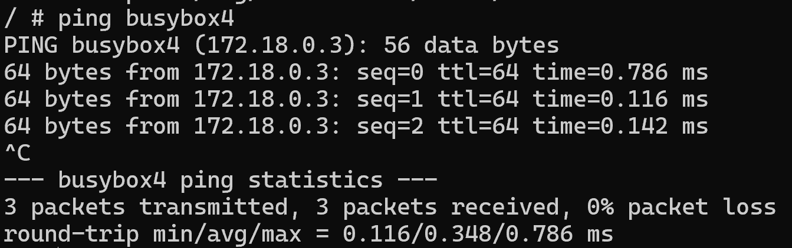

**docker inspect**

1. Docker exec -it busybox1 sh 
2. Ip route show default

busybox 3 hat den gleichen default gateway

- ping busybox2

- ping busybox2

- ping 172.18.0.1

- ping 172.18.0.2

### Busybox3

1. docker exec -it busybox3 sh
2. ip route show default

- ping busybox1

- ping busybox4

- ping 172.18.0.4

- ping 172.18.0.3

## Schlussfolgerung

Meine Schlussfolgerun ist, dass wenn sich Container im selben Netzwerk befinden, können sie miteinader kommunnizieren. Der Unterschied lag darin, dass sich die Container beim KN02 nicht im gleichen Netzwerk befunden haben, sondern mit dem Link sich verknüpft haben.

## KN02
- Die beiden Container befanden sich in dem Netzwerk, welches ich erstellt habe für diesen KN.
- Und sie konnten miteinadner kommunizieren, da sie mit dem link miteinader verknüft wurden.